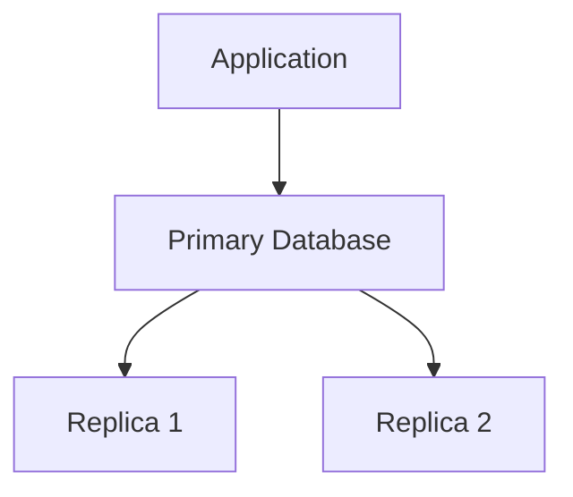
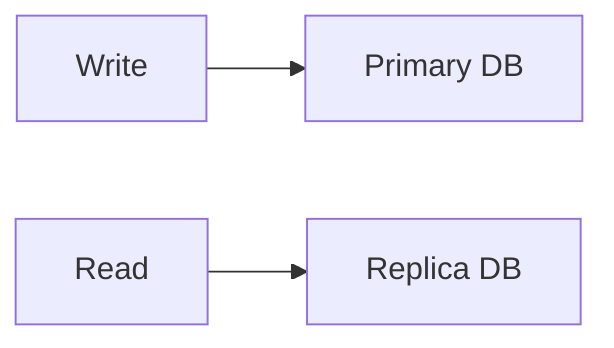
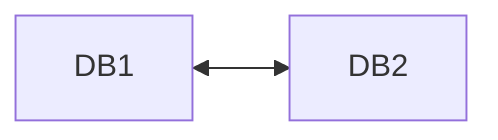

# Day 19 – Database Replication

## What is Database Replication?

**Database replication** is the process of copying and maintaining the same data across multiple database servers.

Instead of having a single database server, replication allows multiple servers to maintain synchronized copies of the data.

### Goals:
- Improve availability
- Increase fault tolerance
- Improve read performance
- Enable scalability

## Why Database Replication is Important

### Without replication:
- ❌ Single point of failure
- ❌ Limited read performance
- ❌ Difficult to scale

### With replication:
- ✔ High availability
- ✔ Improved read scalability
- ✔ Fault tolerance
- ✔ Better disaster recovery

## Basic Replication Architecture

The basic setup involves an application connecting to a primary database, which then replicates data to replicas.

The primary handles **writes**, while replicas handle **reads**.

## Types of Replication

### 1. Master–Slave Replication (Primary–Replica)

One database acts as the **primary (master)** and others as **replicas (slaves)**.

- Writes go to the primary
- Reads can go to replicas

**Benefits:**
- ✔ Improves read performance
- ✔ Distributes traffic

### 2. Master–Master Replication

Multiple databases act as masters, allowing both reads and writes on any node.

**Pros:**
- ✔ High availability

**Cons:**
- ❌ Conflict resolution required

### 3. Synchronous Replication

Data is written to replicas **immediately**, ensuring strong consistency but potentially slower writes.

**Benefits:**
- ✔ Strong consistency

**Drawbacks:**
- ❌ Slower write performance

### 4. Asynchronous Replication

The primary writes data first, and replicas update later, leading to faster writes but possible lag.

**Benefits:**
- ✔ Faster writes

**Drawbacks:**
- ❌ Possible replication lag

## Replication Lag

Replication lag occurs when replicas are **behind the primary database**, causing eventual consistency.

## Example Use Case

In a large web application:

- User writes → Primary DB
- User reads → Replica DB

This setup handles millions of reads and reduces load on the primary.

## Benefits of Database Replication

- ✔ Improved performance
- ✔ High availability
- ✔ Fault tolerance
- ✔ Disaster recovery
- ✔ Read scalability

## Challenges with Replication

- ❌ Replication lag
- ❌ Conflict resolution (in multi-master setups)
- ❌ Data consistency issues
- ❌ Complex setup

## Real-World Databases Supporting Replication

Popular databases that support replication include:

- MySQL
- PostgreSQL
- MongoDB
- Cassandra
- Amazon Aurora

## Common Mistakes

- ❌ Sending writes to replicas
- ❌ Ignoring replication lag
- ❌ No monitoring of replicas
- ❌ Poor failover handling

## Best Practices

- Monitor replication lag regularly
- Use synchronous replication for critical data
- Implement proper failover mechanisms
- Regularly test disaster recovery procedures
- Ensure proper conflict resolution in multi-master setups

✔ Send writes to primary database  
✔ Use replicas for read-heavy workloads  
✔ Monitor replication lag  
✔ Implement automatic failover  
✔ Use backups along with replication  

---

## 🎯 Interview Questions

**Q: What is database replication?**

Copying data from one database server to others.

---

**Q: Why use replication?**

To improve availability and read scalability.

---

**Q: What is replication lag?**

Delay between primary and replica updates.

---

**Q: Difference between synchronous and asynchronous replication?**

Synchronous → Immediate replication  
Asynchronous → Delayed replication

---

## ✅ Key Takeaway

Database replication enables:

✔ High availability  
✔ Improved performance  
✔ Fault tolerance  
✔ Scalable backend systems  

It is a fundamental technique used in distributed databases.

✨ End of Day 19